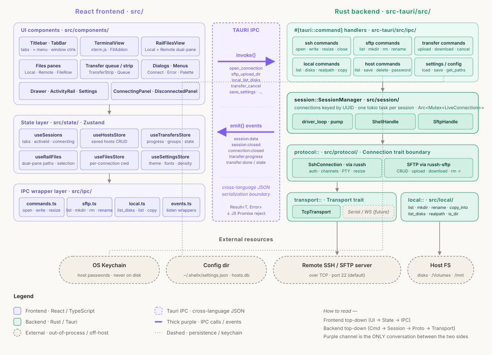

# ShellX

**English** · [简体中文](./README.zh-CN.md)

A tiny, pretty terminal + file-transfer client — cross-platform (Windows / macOS / Linux), open source, built on Tauri + Rust + React.

Current release: **v0.30.0** — see [`docs/release-notes/`](docs/release-notes/) for what changed.

---

## 1. What is ShellX

ShellX is a desktop app that gives you:

- **SSH terminal** in tabs — connect to Linux / BSD / macOS servers, get a working shell with themes, custom fonts, cursor style; public-key (Ed25519/RSA/ECDSA) or password auth, host-key verification against `~/.ssh/known_hosts`. Ctrl+Shift+C/V copy and paste with a preview before multi-line pastes run, and right-click offers Copy / Paste / Select all
- **Local terminal** — open a shell on your own machine (PowerShell by default on Windows; any shell via Settings) in a tab right next to your SSH sessions
- **Serial terminal** — a Serial view lists live COM ports (USB adapters shown with their chip name) and your saved profiles; quick-connect at 115200 8N1 or save a profile with full line settings (baud, data/stop bits, parity, flow control). Sessions open right inside the view with a per-session local-echo toggle and a line-ending choice (CR / LF / CRLF / None) for talking to devices that don't echo
- **SSH tunnels (port forwarding)** — a dedicated Tunnels view lists every saved forward across every host in one place; start any rule directly (shellx opens the SSH transport silently when the host isn't already connected), auto-reconnect with backoff when a tunnel drops, autostart selected rules on app launch, drag rows to reorder, move a rule between hosts without recreating, share on the LAN (bind 0.0.0.0), or paste an `ssh -L …` command to bulk-import rules
- **Structured logs** — Settings → Logs shows a real-time stream of every event across tunnels, sessions, file transfers, sftp, monitor, host-key checks, keychain and updater. Filter by level / category / free-text, click any row for full JSON, and export a jsonl dump for bug reports; daily-rotated files at `~/.shellx/logs/` with 7-day retention
- **SFTP file browser** — WinSCP-style dual-pane (local ↔ remote) with drag-and-drop upload / download, folder transfers, pause / resume / cancel, and drag-out: drop a row past the window edge straight into Explorer or onto the desktop. The transfer strip shows one row per drag — a 20 000-file folder is a single line with its own progress, speed and ETA, never a scrolling file list
- **FTP view** — a dedicated view for SFTP / FTP / FTPS connections with the same dual-pane, queue and drag. Made for old machines: filename encoding (auto / UTF-8 / GBK), passive or active mode, explicit or implicit TLS — and plain FTP is clearly tagged as plaintext. Saved SSH hosts import as SFTP connections in one click. Directory listings are cached and the tree warms in the background over dedicated connections, so browsing a far-away server feels instant after connect
- **Command completion** — type at any prompt and a dropdown offers your own per-host command history (`h`) plus a built-in dictionary of common commands (`c`). ↑/↓ and Tab to accept; a plain Enter always runs what you typed. Local only — nothing installed on the server, and lines that look like they carry secrets are never recorded
- **Command snippets** — save the commands worth not retyping and call them anywhere with Ctrl+Shift+K: filter, Enter, and the command lands on the terminal's input line (opt-in run-on-pick per snippet). `${name}` blanks ask for their values with a live preview, and the library travels in your config bundle
- **Session monitor** — an at-a-glance dashboard for any Linux host over the same SSH connection: an always-visible KPI strip (CPU / memory / swap / network / disk I/O) with trends, 1/5/15-minute load averages and since-boot totals, a per-core heatmap, a process table with inline bars, filesystem usage coloured by fullness, and — when present — a Docker containers tab (per-container CPU / memory / net / block) and a red Alerts tab listing failed systemd units with copy-ready journalctl / restart commands. Adjustable 1–30 s poll interval
- **Saved hosts + keychain** — store your servers once, quick-connect from the sidebar or the `+` menu; passwords live in the OS keychain, not a plaintext config. Ctrl-click / Shift-click to pick several rows and delete them in one confirmation
- **Import & export** — pull machines straight out of `~/.ssh/config` (wildcards, `Match` blocks and `Include` lines are reported as skipped rather than dropped), or carry a whole setup to another computer as one JSON file: hosts, tunnel rules, and optionally your settings. Passwords and key passphrases stay in the OS keychain and are never written to the file — the file only records which hosts had one, so the import can tell you what will ask again
- **Light or dark theme** — Light is default; toggle to Dark in Settings and the whole app (including the terminal palette) follows
- **Bilingual interface** — switch the whole UI between English and Chinese in Settings, applied live
- **Split panes** — drag a tab onto the edge of a pane to split it, onto the middle to swap the two, or onto the outer band of the area for a full-width row or full-height column. Same-direction splits stay evenly divided; drag a divider to resize, double-click it to level the row. Each pane switches its own Terminal / Files / Tunnels / Monitor
- **Advanced settings** — Settings → Advanced tunes SSH connect timeout and keepalive, concurrent SFTP transfers, terminal scrollback, tunnel reconnect delay and attempt limit, and how much detail the logs record
- **Auto-update** — checks for new releases on startup (can be disabled), shows a banner in Settings → About with a one-click download and relaunch; releases are signed with a Minisign key

It's a single ~7 MB installer with no runtime dependencies (Tauri bundles a small Rust binary and reuses the OS-native webview instead of shipping Chromium — that's why it's small).

---

## 2. Architecture

ShellX has two halves and a boundary between them.



### The frontend

`src/` is a Vite-built React app in TypeScript. Nothing in it talks to the network directly — every remote / local IO call goes through a thin `ipc/*.ts` wrapper that calls the Rust backend via Tauri's `invoke()`. State lives in Zustand stores (`src/state/`) — sessions list, saved hosts, ongoing transfers, appearance settings.

### The backend

`src-tauri/src/` is a Rust binary crate wrapped by Tauri. It exposes a set of `#[tauri::command]` functions (`src-tauri/src/ipc/`) that the frontend calls. The interesting layers behind that:

- **transport/** — bytes over the wire. Just TCP today; the trait is designed so RS-232 / WebSocket can plug in without touching upper layers.
- **protocol/** — SSH (via [`russh`](https://github.com/warp-tech/russh)) and SFTP. Auth, PTYs, channels, resize, file transfers.
- **session::SessionManager** — owns every live connection keyed by UUID. Each session runs a dedicated `tokio` task that pumps bytes between the network and the frontend (via `session:data` / `session:closed` Tauri events).
- **local/** — host filesystem: list, mkdir, rename, copy, disk enumeration for the disk picker.

### Communication

- **Command → response**: frontend calls `invoke("sftp_upload", args)`; Rust runs the handler, returns a JSON-serializable result or error.
- **Server → client stream**: Rust `emit`s Tauri events (`session:data`, `transfer:progress`, `transfer:done`, `connection:closed`, …); frontend `listen`s and updates the store.

That's the whole picture. Add a new file operation? Write one command in `src-tauri/src/ipc/`, one wrapper in `src/ipc/`. Add a new transport? Implement the trait in `src-tauri/src/transport/`.

---

## 3. Running ShellX locally

This section is for developers who want to build and run ShellX from source. **You don't need to know Rust or Tauri** — the tooling handles almost everything. You do need to install a few things once.

### 3.1 Install the tooling (one-time)

**All platforms — Node.js + pnpm** (for the frontend):

1. Install Node.js 20 LTS or newer from [nodejs.org](https://nodejs.org/). Verify:

   ```bash
   node --version
   ```

2. Install pnpm globally:

   ```bash
   npm install -g pnpm
   pnpm --version
   ```

**All platforms — Rust** (for the backend). Rust ships with a tool called `cargo` which is like `npm` for Rust. You install both at once via `rustup`:

- **Windows / macOS / Linux — the one-command install**:

  Go to [rustup.rs](https://rustup.rs/) and follow the on-screen instructions. It's a single command:

  ```bash
  # macOS / Linux
  curl --proto '=https' --tlsv1.2 -sSf https://sh.rustup.rs | sh
  ```

  ```powershell
  # Windows — download and run rustup-init.exe from https://rustup.rs/
  ```

  Accept the defaults. When it's done, close and reopen your terminal, then verify:

  ```bash
  cargo --version    # e.g. cargo 1.83.0
  rustc --version    # e.g. rustc 1.83.0
  ```

**Platform-specific extras**:

| OS      | You also need                                                                                         |
| ------- | ----------------------------------------------------------------------------------------------------- |
| Windows | **Visual Studio Build Tools** (C++ workload). `rustup` will offer to install it the first time — accept. **WebView2** is pre-installed on Windows 11; on Windows 10 install the [Evergreen Runtime](https://developer.microsoft.com/microsoft-edge/webview2/). |
| macOS   | **Xcode Command Line Tools** — `xcode-select --install`.                                              |
| Linux   | `sudo apt install libwebkit2gtk-4.1-dev build-essential curl wget file libxdo-dev libssl-dev libayatana-appindicator3-dev librsvg2-dev` (Debian/Ubuntu; other distros: [Tauri prerequisites](https://tauri.app/start/prerequisites/)). |

### 3.2 Get the code + install frontend deps

```bash
git clone <this-repo>
cd shellx
pnpm install
```

That downloads all the frontend dependencies (React, xterm.js, Zustand, etc.) into `node_modules/`.

Rust dependencies are downloaded automatically the first time you build — you don't `cargo install` anything by hand.

### 3.3 Run the app in dev mode

```bash
pnpm tauri:dev
```

What happens:

1. Vite starts a dev server on port 1420 (auto-reload on frontend file changes).
2. Cargo compiles the Rust backend. **The first build takes 5–15 minutes** and downloads ~2 GB of Rust dependencies into `src-tauri/target/`. Every build after that is incremental — seconds.
3. A native desktop window opens with the ShellX app. Edit any React file → HMR live-reloads. Edit any Rust file → Tauri rebuilds and relaunches automatically.

Close the window to stop the dev server.

> **Slow crates.io / GFW users**: the repo already includes `src-tauri/.cargo/config.toml` pointing cargo at `rsproxy.cn`. No config needed.

### 3.4 Build a release installer

```bash
pnpm tauri:build
```

Produces a native installer under `src-tauri/target/release/bundle/`:

- **Windows**: `bundle/msi/shellx_<version>_x64_en-US.msi` and `bundle/nsis/shellx_<version>_x64-setup.exe`
- **macOS**: `bundle/dmg/shellx_<version>_universal.dmg`
- **Linux**: `bundle/appimage/shellx_<version>_amd64.AppImage`, `bundle/deb/shellx_<version>_amd64.deb`, `bundle/rpm/shellx-<version>-1.x86_64.rpm`

Release builds are 5–15 min on a warm cache (LTO is on).

### 3.5 Tests

```bash
# Frontend tests (Vitest + Testing Library)
pnpm test --run

# Rust unit tests
cd src-tauri && cargo test --lib

# Rust integration tests (in-process SSH / SFTP fixtures — no Docker needed)
cd src-tauri && cargo test --features test-fixtures --test ssh_integration
cd src-tauri && cargo test --features test-fixtures --test sftp_integration
```

TypeScript typecheck:

```bash
pnpm tsc --noEmit
```

---

## Keyboard shortcuts

| Action                  | Windows / Linux                  | macOS                            |
| ----------------------- | -------------------------------- | -------------------------------- |
| New tab                 | `Ctrl+Shift+T`                   | `Cmd+T`                          |
| Close tab               | `Ctrl+Shift+W`                   | `Cmd+W`                          |
| Next / previous tab     | `Ctrl+Tab` / `Ctrl+Shift+Tab`    | `Ctrl+Tab` / `Ctrl+Shift+Tab`    |
| Command palette         | `Ctrl+K`                         | `Cmd+K`                          |
| Toggle sidebar drawer   | `Ctrl+Shift+B`                   | `Cmd+B`                          |
| Search in terminal      | `Ctrl+Shift+F`                   | `Ctrl+Shift+F`                   |
| Snippets                | `Ctrl+Shift+K`                   | `Cmd+Shift+K`                    |
| Terminal copy / paste   | `Ctrl+Shift+C` / `Ctrl+Shift+V`  | `Ctrl+Shift+C` / `Ctrl+Shift+V`  |

Windows/Linux use `Ctrl+Shift+T` / `Ctrl+Shift+W` (not `Ctrl+T` / `Ctrl+W`) so they don't collide with terminal-inside-terminal muscle memory (`Ctrl+T` and `Ctrl+W` are common bash/tmux bindings).

---

## Troubleshooting

**`error: Missing manifest in toolchain 'stable-…'`** — the Rust toolchain install was interrupted (Windows Defender often does this). Fix:

```bash
rustup toolchain uninstall stable
rustup toolchain install stable --profile minimal --force
rustup component add cargo rust-std
cargo --version && rustc --version
```

**Downloads keep failing with `os error 2` mid-transfer** — Defender racing with rustup. Set `RUSTUP_DIST_SERVER=https://rsproxy.cn` and `RUSTUP_UPDATE_ROOT=https://rsproxy.cn/rustup` before retrying.

**`warning: output filename collision at ... shellx.pdb`** — benign; `[lib]` and `[[bin]]` share the crate name. Build succeeds. See [rust-lang/cargo#6313](https://github.com/rust-lang/cargo/issues/6313).

**Windows Defender flags the built exe** — it's unsigned. Code signing is on the v1.0 roadmap; for now, right-click → Properties → **Unblock**.

---

## License

MIT — see [`LICENSE`](LICENSE).
