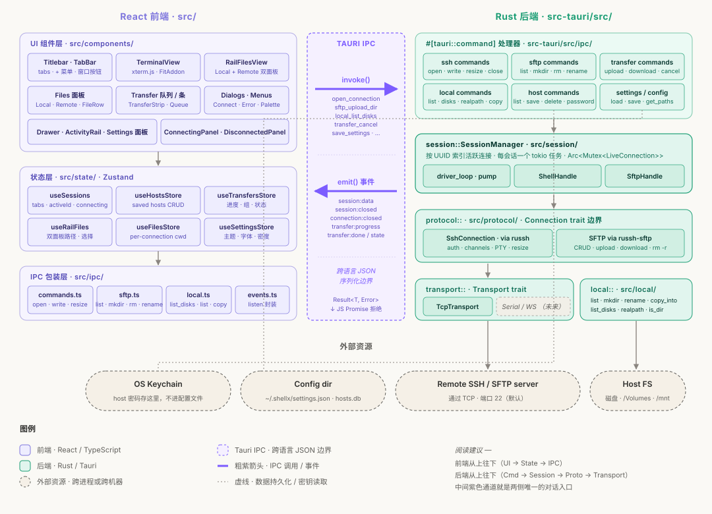

# shellx

[English](./README.md) · **简体中文**

一个小巧、精致的终端 + 文件传输客户端 —— 跨平台（Windows / macOS / Linux），开源，基于 Tauri + Rust + React。

当前版本：**v0.13.0** —— 见 [`docs/release-notes/`](docs/release-notes/) 了解本版本变更。

---

## 1. shellx 是什么

shellx 是一个桌面应用，提供：

- **SSH 终端**（多 tab）—— 连接 Linux / BSD / macOS 服务器，主题、字体、光标样式全可定制；支持公钥（Ed25519/RSA/ECDSA）或密码认证，连接时对照 `~/.ssh/known_hosts` 验证 host key
- **本地终端** —— 在 SSH 会话旁边直接打开本机 shell（Windows 默认 PowerShell，可在设置里换任意 shell）
- **SSH 隧道（端口转发）** —— 按主机保存 `-L` 转发规则，实时开关、拖拽排序、局域网共享（绑定 0.0.0.0），还能粘贴完整 `ssh` 命令一键导入规则、地址、端口和密钥文件
- **SFTP 文件浏览器** —— WinSCP 风格的双面板（本地 ↔ 远程），支持拖拽上传下载、目录传输、暂停/继续/取消
- **保存主机 + 系统密钥链** —— 存一次主机信息，从侧边栏或 `+` 菜单一键连接；密码存在 OS 的 keychain 里，不会明文写配置
- **双语界面** —— 在设置里一键切换整个界面的中英文，实时生效

单个 ~7 MB 的安装包，无运行时依赖（Tauri 打包一个小的 Rust 二进制，复用 OS 自带的 WebView 而不是打包 Chromium —— 这就是为什么这么小）。

---

## 2. 架构

shellx 分成前后端两半，中间隔着一层清晰的 IPC 边界。



### 前端

`src/` 是 TypeScript 写的 React 应用，Vite 打包。里面**不直接**访问网络 —— 所有远程/本地 IO 都走一层薄的 `ipc/*.ts` 包装，通过 Tauri 的 `invoke()` 调后端。状态放在 Zustand store（`src/state/`）：会话列表、保存的主机、正在进行的传输、外观设置。

### 后端

`src-tauri/src/` 是一个 Tauri 包裹的 Rust binary crate。它暴露一组 `#[tauri::command]` 函数（`src-tauri/src/ipc/`）供前端调用。层次结构：

- **transport/** —— 通过网络传字节。目前只有 TCP；trait 设计让 RS-232 / WebSocket 未来能无缝加入，上层不用改。
- **protocol/** —— SSH（用 [`russh`](https://github.com/warp-tech/russh)）+ SFTP。认证、PTY、channel、resize、文件传输。
- **session::SessionManager** —— 用 UUID 索引每个活跃连接。每个会话跑一个专门的 `tokio` 任务，双向搬运字节（通过 `session:data` / `session:closed` 这样的 Tauri 事件给前端）。
- **local/** —— 本机文件系统：list、mkdir、rename、copy、磁盘枚举（给磁盘选择器用）。

### 前后端通信

- **命令 → 响应**：前端 `invoke("sftp_upload", args)`，Rust 跑对应 handler，返回可 JSON 序列化的结果或错误。
- **后端主动推流**：Rust `emit` Tauri 事件（`session:data`、`transfer:progress`、`transfer:done`、`connection:closed` 等）；前端 `listen` 更新 store。

新增一个文件操作？在 `src-tauri/src/ipc/` 写一个 command，`src/ipc/` 写一层包装。新增一个传输层？在 `src-tauri/src/transport/` 实现 trait。

---

## 3. 本地跑起来

这一节是给想从源码构建 shellx 的开发者的。**你不用懂 Rust 或 Tauri** —— 工具链处理了绝大部分事。只需要装一次几个东西。

### 3.1 装工具链（只装一次）

**全平台：Node.js + pnpm**（前端要用）：

1. 从 [nodejs.org](https://nodejs.org/) 装 Node.js 20 LTS 或以上。验证：

   ```bash
   node --version
   ```

2. 全局装 pnpm：

   ```bash
   npm install -g pnpm
   pnpm --version
   ```

**全平台：Rust**（后端要用）。Rust 自带一个叫 `cargo` 的工具，相当于 Rust 界的 `npm`。两个东西一起装，通过 `rustup`：

- **Windows / macOS / Linux 一键安装**：

  访问 [rustup.rs](https://rustup.rs/) 按指引装。就一条命令：

  ```bash
  # macOS / Linux
  curl --proto '=https' --tlsv1.2 -sSf https://sh.rustup.rs | sh
  ```

  ```powershell
  # Windows —— 从 https://rustup.rs/ 下载并运行 rustup-init.exe
  ```

  一路默认。装完关掉终端重开，验证：

  ```bash
  cargo --version    # 类似 cargo 1.83.0
  rustc --version    # 类似 rustc 1.83.0
  ```

**分平台的额外依赖**：

| 系统    | 还需要装                                                                                          |
| ------- | ------------------------------------------------------------------------------------------------- |
| Windows | **Visual Studio Build Tools**（C++ 工作负载）。首次运行 `rustup` 会主动提示你装 —— 接受即可。**WebView2** Windows 11 已内置；Windows 10 装一次 [Evergreen Runtime](https://developer.microsoft.com/microsoft-edge/webview2/)。 |
| macOS   | **Xcode Command Line Tools** —— `xcode-select --install`。                                          |
| Linux   | `sudo apt install libwebkit2gtk-4.1-dev build-essential curl wget file libxdo-dev libssl-dev libayatana-appindicator3-dev librsvg2-dev`（Debian/Ubuntu；其他发行版参考 [Tauri prerequisites](https://tauri.app/start/prerequisites/)）。 |

### 3.2 拉代码 + 装前端依赖

```bash
git clone <this-repo>
cd shellx
pnpm install
```

这一步把前端依赖（React、xterm.js、Zustand 等）下载到 `node_modules/`。

Rust 依赖在第一次编译时自动下载，**不用你手动 `cargo install` 任何东西**。

### 3.3 开发模式运行

```bash
pnpm tauri:dev
```

发生的事：

1. Vite 在 1420 端口启动开发服务器（前端文件改动自动 HMR）。
2. Cargo 编译 Rust 后端。**第一次编译 5–15 分钟**，会下载约 2 GB Rust 依赖到 `src-tauri/target/`。之后都是增量编译，几秒钟。
3. 弹出 shellx 的原生窗口。改 React 文件 → HMR 热更新；改 Rust 文件 → Tauri 自动重编译并重启窗口。

关掉窗口就退出开发服务器。

> **crates.io 慢 / GFW 用户**：仓库自带 `src-tauri/.cargo/config.toml` 指向 `rsproxy.cn`，不用你配置。

### 3.4 打 release 安装包

```bash
pnpm tauri:build
```

产物在 `src-tauri/target/release/bundle/` 下：

- **Windows**：`bundle/msi/shellx_<version>_x64_en-US.msi` 和 `bundle/nsis/shellx_<version>_x64-setup.exe`
- **macOS**：`bundle/dmg/shellx_<version>_universal.dmg`
- **Linux**：`bundle/appimage/shellx_<version>_amd64.AppImage`、`bundle/deb/shellx_<version>_amd64.deb`、`bundle/rpm/shellx-<version>-1.x86_64.rpm`

Release 构建 5–15 分钟（开了 LTO）。

### 3.5 测试

```bash
# 前端测试（Vitest + Testing Library）
pnpm test --run

# Rust 单元测试
cd src-tauri && cargo test --lib

# Rust 集成测试（进程内 SSH / SFTP fixture —— 不需要 Docker）
cd src-tauri && cargo test --features test-fixtures --test ssh_integration
cd src-tauri && cargo test --features test-fixtures --test sftp_integration
```

TypeScript 类型检查：

```bash
pnpm tsc --noEmit
```

---

## 快捷键

| 动作                    | Windows / Linux                  | macOS                            |
| ----------------------- | -------------------------------- | -------------------------------- |
| 新建 tab                | `Ctrl+Shift+T`                   | `Cmd+T`                          |
| 关闭 tab                | `Ctrl+Shift+W`                   | `Cmd+W`                          |
| 上一个 / 下一个 tab     | `Ctrl+Tab` / `Ctrl+Shift+Tab`    | `Ctrl+Tab` / `Ctrl+Shift+Tab`    |
| 命令面板                | `Ctrl+K`                         | `Cmd+K`                          |
| 侧边栏抽屉开关          | `Ctrl+Shift+B`                   | `Cmd+B`                          |
| 终端内搜索              | `Ctrl+Shift+F`                   | `Ctrl+Shift+F`                   |

Windows/Linux 上用 `Ctrl+Shift+T` / `Ctrl+Shift+W`（不是 `Ctrl+T` / `Ctrl+W`），避免和终端里的常用绑定冲突（bash / tmux 通常都用 `Ctrl+T` 和 `Ctrl+W`）。

---

## 常见问题

**`error: Missing manifest in toolchain 'stable-…'`** —— Rust toolchain 安装中途被打断（Windows Defender 经常干这事）。修：

```bash
rustup toolchain uninstall stable
rustup toolchain install stable --profile minimal --force
rustup component add cargo rust-std
cargo --version && rustc --version
```

**下载老是失败，报 `os error 2`（文件在传输中被重命名）** —— Defender 在跟 rustup 抢文件。设 `RUSTUP_DIST_SERVER=https://rsproxy.cn` 和 `RUSTUP_UPDATE_ROOT=https://rsproxy.cn/rustup` 再试。

**`warning: output filename collision at ... shellx.pdb`** —— 无害。`[lib]` 和 `[[bin]]` 共享 crate 名。构建正常，二进制能跑。详见 [rust-lang/cargo#6313](https://github.com/rust-lang/cargo/issues/6313)。

**Windows Defender 拦截构建出来的 exe** —— 没做代码签名。签名在 v1.0 路线图上，现在的解法：右键 → 属性 → **解除阻止**。

---

## 许可证

MIT —— 见 [`LICENSE`](LICENSE)。
